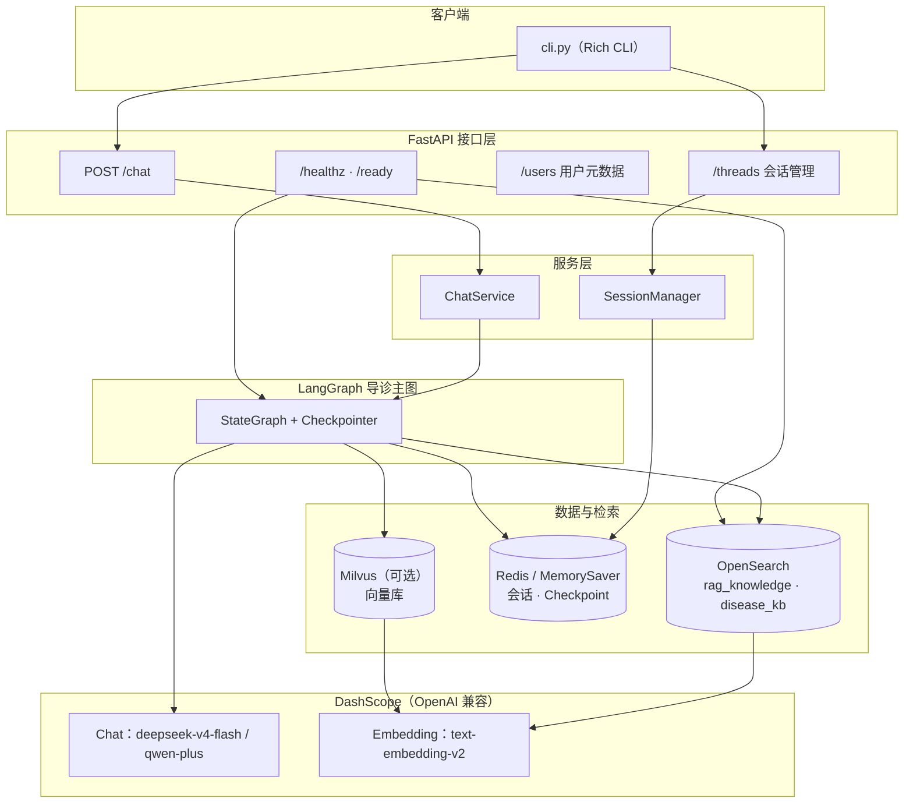
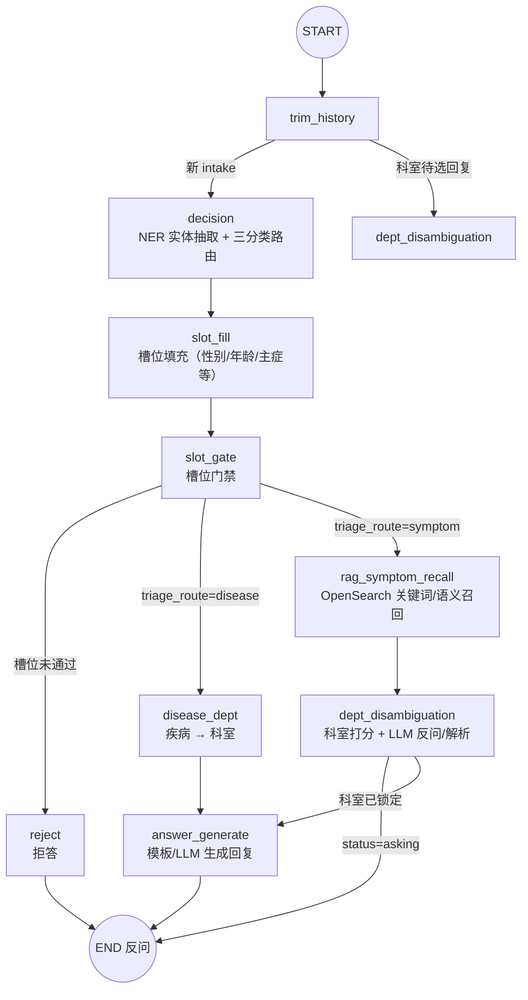

# 生产级医院导诊 Agentic 助手

基于 FastAPI + LangGraph + Redis + Elasticsearch + Milvus + DashScope 的医院导诊问答与流程指引助手，同时提供命令行前端（rich CLI），可以作为生产级医疗导诊 / 医疗流程问答系统的参考实现。

后端通过 LangGraph 状态机编排多轮对话、症状问诊、流程检索与意图识别，前端则以 CLI 形式演示多会话聊天体验（类似 ChatGPT 的会话列表）。

---

## 功能特性

- 医疗导诊对话
  - 支持面向「症状问诊」和「就医流程」的多轮对话。
  - 结合向量检索与流程文档检索，给出答案和建议。
- Agentic 对话编排（LangGraph）
  - 使用 `AppState` 管理对话状态，基于 LangGraph 构建状态机。
  - 包含意图识别、RAG 检索、文档评估、Query 重写、答案生成等节点。
- 多会话管理（类似 ChatGPT）
  - 会话列表、创建会话、删除会话、切换当前会话。
  - 会话与用户元数据（名称、创建时间、最近活跃时间）存储在 Redis。
- 检索增强生成（RAG）
  - Elasticsearch：医院流程 / 制度等结构化文档检索。
  - Milvus：症状 / 医疗知识向量检索。
  - DashScope Embedding + Chat 模型。
- 命令行前端（rich CLI）
  - `cli.py` 提供交互式 CLI，支持斜杠命令和 Markdown 渲染。
  - 通过 REST API 与后端通信，可作为 Web 前端的参考。

---

## 项目结构

```text
app/
  main.py                  # FastAPI 应用入口（create_app / healthz）
  api/
    routers/
      chat.py              # /chat 对话接口
      threads.py           # /threads 会话管理接口
      users.py             # /users 用户信息接口
  core/
    config.py              # 环境变量 & 配置集中管理
    logging.py             # 日志配置
    llm.py                 # DashScope 兼容 OpenAI 的 Chat / Embedding 封装
  domain/
    models.py              # AppState、IntentResult、RetrievedDoc 等领域模型
    routing.py             # LangGraph 节点路由决策
  graph/
    builder.py             # LangGraph 状态机构建与编译
    nodes/                 # 各种节点：decision / es_rag / milvus_rag / ...
  infra/
    redis_client.py        # Redis 连接 & LangGraph RedisSaver
    es_client.py           # Elasticsearch 客户端封装
    milvus_client.py       # Milvus 客户端封装
  sessions/
    manager.py             # 会话管理：user_id / thread_id 元数据
  services/
    chat_service.py        # ChatService：衔接 API 与 LangGraph

cli.py                     # rich + requests 命令行前端
demo.py                    # 早期 demo / CLI 版本（保留作参考）
后端设计提示词.md          # 后端设计提示与思考过程
前端设计提示词.md          # 前端设计提示与交互构想
项目总结.md                # 后端整体架构与实现总结
```

---

## 核心架构概览

### 系统分层



### LangGraph 导诊主图

当前生产主图（`app/graph/builder.py`）采用 **槽位门禁 + OpenSearch RAG + 科室消歧** 流程：



**路由说明：**

| 阶段 | 节点 | 作用 |
|------|------|------|
| 历史裁剪 | `trim_history` | 超长对话裁剪；若处于科室待选则直接进入消歧 |
| 意图识别 | `decision` | LLM NER 抽取症状/疾病，规则路由 `disease` / `symptom` / `reject` |
| 槽位 | `slot_fill` → `slot_gate` | 补齐导诊必填槽位，未通过则拒答 |
| 疾病链 | `disease_dept` | 疾病知识库查科室，模板生成回复 |
| 症状链 | `rag_symptom_recall` → `dept_disambiguation` | OpenSearch 混合检索候选科室，多轮消歧后锁定 |
| 回复 | `answer_generate` | 综合锁定科室与上下文输出导诊建议 |

### 各层职责

- **接口层（`app/api`）**
  - `POST /chat`：单轮对话入口，输入 `user_id` / `thread_id` / `message`，返回回复、意图、参考文档等。
  - `GET/POST/DELETE /threads`：多会话管理。
  - `POST/GET /users`：用户元数据。
  - `GET /healthz`、`GET /ready`：健康检查（含 LangGraph + OpenSearch）。
- **服务层（`app/services`）**
  - `ChatService`：衔接 API 与 LangGraph，管理 Checkpoint 与线程状态。
- **图编排层（`app/graph`）**
  - `builder.py`：编译导诊主图（见上图）。
  - `nodes/*`：`decision`、`slot_fill`、`slot_gate`、`rag_symptom_recall`、`dept_disambiguation`、`disease_dept`、`answer_generate` 等。
- **NER / 导诊规则（`app/ner`、`app/triage`）**
  - 实体抽取、三分类路由、科室打分、消歧反问、会话状态重置。
- **基础设施层（`app/infra`）**
  - **OpenSearch**（`opensearch-py`）：`rag_knowledge` 症状召回、`disease_kb` 疾病科室。
  - **Redis**：会话元数据 + LangGraph Checkpoint（不可用时可回退 `MemorySaver`）。
  - **Milvus**：可选向量检索通道（demo 保留，主图当前以 OpenSearch 为主）。
  - **DashScope**：Chat + Embedding 模型（`app/core/llm.py`）。
- **会话管理（`app/sessions`）**
  - 基于 Redis 管理 `user_id` / `thread_id`、标题、活跃时间等。

---

## 环境依赖

- Python 3.10+
- Redis
- Elasticsearch
- Milvus（或兼容协议的向量库）
- DashScope 账号与 API Key（兼容 OpenAI API）

主要 Python 依赖（摘要）：

- `fastapi`
- `uvicorn`
- `langgraph`
- `langchain-core`
- `langchain-openai`
- `redis`
- `pymilvus`
- `elasticsearch`
- `python-dotenv`
- `rich`
- `requests`

（具体依赖请根据实际 `pyproject.toml` / `requirements.txt` 或本地环境为准。）

---

## 配置与环境变量

核心环境变量集中在 `app/core/config.py` 中，项目会通过 `python-dotenv` 自动加载 `.env` 文件。

必填：

- `DASHSCOPE_API_KEY`：DashScope 兼容 OpenAI API 的密钥。

可选（带默认值）：

- `ES_URL`：Elasticsearch 地址，默认 `http://localhost:9200`。
- `MILVUS_URI`：Milvus 地址，默认 `http://localhost:19530`。
- `REDIS_URI`：Redis 地址，默认 `redis://localhost:6379`。
- `ES_INDEX_NAME`：流程文档索引名，默认 `hospital_procedures`。
- `MILVUS_COLLECTION`：Milvus 集合名，默认 `medical_knowledge`。
- `MILVUS_TOP_K` / `MILVUS_MIN_SIM` / `MILVUS_MAX_DOCS`：Milvus 检索参数。
- `MAX_REWRITE`：允许的最大 Query 重写次数。
- `MAX_HISTORY_MSGS` / `TRIM_TRIGGER_MSGS`：会话历史裁剪控制。
- `CHAT_MODEL_NAME`：聊天模型名，默认 `qwen3-max`。
- `EMBEDDING_MODEL_NAME`：向量模型名，默认 `text-embedding-v2`。
- `CHAT_BASE_URL` / `EMBEDDING_BASE_URL`：DashScope 兼容 OpenAI 接口地址。
- `LLM_TIMEOUT` / `LLM_MAX_RETRIES` / `LLM_TEMPERATURE`：LLM 请求配置。

CLI 相关：

- `BACKEND_BASE_URL`：CLI 连接的后端地址，默认 `http://localhost:8000`。
- `BACKEND_TIMEOUT`：CLI 请求超时时间（秒），默认 `120`。

---

## 一键启动（Windows 本地开发）

项目提供 **OpenSearch + FastAPI/LangGraph** 的一键拉起脚本，适合日常改代码后快速验证。

### 前置准备（首次）

| 项 | 说明 |
|----|------|
| **Python 3.11** | 推荐用 [uv](https://docs.astral.sh/uv/) 管理虚拟环境 |
| **OpenSearch 2.19** | 解压到 `esTools\opensearch-2.19.1-windows-x64\opensearch-2.19.1`（路径可在配置中改） |
| **DashScope API Key** | 复制 `.env.example` → `.env`，填入 `DASHSCOPE_API_KEY` |
| **Redis** | 可选；无 Docker 时设 `USE_MEMORY_CHECKPOINTER=true`（会话存内存，重启丢失） |

```powershell
cd D:\InitialArchitectureForMedicalAgent1

# 1. Python 环境（首次）
uv venv --python 3.11
uv pip install -r requirements.txt

# 2. 环境变量
copy .env.example .env
# 编辑 .env：DASHSCOPE_API_KEY、CHAT_MODEL_NAME 等

# 3. OpenSearch 入库（首次 / 数据变更后）
$env:PYTHONPATH = "."
.\.venv\Scripts\python.exe demo\opensearch_rag_kb.py --no-embed   # 仅关键词
# .\.venv\Scripts\python.exe demo\opensearch_rag_kb.py            # 含向量混合检索
```

### 常用命令

在项目根目录执行：

```powershell
# 启动 OpenSearch + API，并自动健康检查
.\start-dev.ps1

# 或双击 / cmd
start-dev.cmd

# 只看状态
.\start-dev.ps1 -Action status

# 只跑验证（OpenSearch、/ready、rag_knowledge 文档数）
.\start-dev.ps1 -Action verify

# 启动但不验证（更快）
.\start-dev.ps1 -Action start -SkipVerify

# 停止 API / OpenSearch
.\start-dev.ps1 -Action stop
```

启动成功后：

| 入口 | 地址 |
|------|------|
| API 文档 | http://127.0.0.1:8000/docs |
| 健康检查 | http://127.0.0.1:8000/healthz |
| 就绪检查 | http://127.0.0.1:8000/ready |
| OpenSearch | http://127.0.0.1:9200 |
| CLI 对话 | `.\.venv\Scripts\python.exe cli.py` |

### 配置与日志

改路径、端口、验证项只需编辑 **`scripts/dev-services.config.ps1`**：

```powershell
# 示例：开启 Dashboards、改 API 端口、打开 Chat 冒烟测试
Dashboards.Enabled = $true
Api.Port = 8000
Verify.ChatSmoke = $false   # true 会调 LLM，消耗额度
```

| 配置块 | 作用 |
|--------|------|
| `OpenSearch` | 本地 zip 路径、`Url`、启动等待秒数 |
| `Api` | FastAPI 地址/端口、是否 `--reload` |
| `Verify` | 启动后检查 OpenSearch、`/ready`、索引文档数等 |
| `Logs.Dir` | 服务日志目录（默认 `logs/`） |

日志文件：`logs/opensearch.log`、`logs/api.log`。

### 前台调试 API（热重载）

后台一键启动适合联调；改代码时建议前台跑 API：

```powershell
powershell -ExecutionPolicy Bypass -File scripts\start-api.ps1
```

等价于 `uvicorn app.main:app --host 0.0.0.0 --port 8000 --reload`，日志直接打在终端。

### 可选：Docker 启动 Redis

```powershell
docker compose -f demo/docker-compose.local.yml up -d redis
```

`.env` 中设置 `REDIS_URI=redis://localhost:6379`、`USE_MEMORY_CHECKPOINTER=false` 后重启 API。

更完整的 Windows 部署说明见 [`docs/DEPLOY_WINDOWS.md`](docs/DEPLOY_WINDOWS.md)。

---

## 本地开发与运行（手动分步）

若不使用一键脚本，可按以下步骤操作。

### 0. 前置准备

- Python 3.11+（推荐 uv + `.venv`）
- OpenSearch 2.x（或兼容 ES API 的检索服务）
- DashScope API Key
- Redis / Milvus 为可选项

### 1. 安装依赖

```powershell
uv venv --python 3.11
uv pip install -r requirements.txt
```

### 2. RAG 数据入库（OpenSearch）

```powershell
$env:PYTHONPATH = "."
.\.venv\Scripts\python.exe demo\opensearch_rag_kb.py
.\.venv\Scripts\python.exe demo\opensearch_disease_kb.py
```

数据文件：`demo/data/rag_knowledge.jsonl`、`demo/data/disease_kb.jsonl`。

### 3. 启动后端

```powershell
$env:PYTHONPATH = "."
.\.venv\Scripts\uvicorn.exe app.main:app --host 127.0.0.1 --port 8000 --reload
```

### 4. 运行 CLI

```powershell
.\.venv\Scripts\python.exe cli.py
```

常用命令：`/help`、`/threads`、`/new`、`/switch`、`/delete`、`/user`、`/exit`。

---

## API 简要说明

仅列出核心接口，详细字段可通过代码或自动文档（FastAPI Swagger）查看。

- `POST /chat`
  - 请求体：`{ user_id: string, thread_id?: string, message: string }`
  - 响应体（简化）：  
    - `user_id`: 用户 ID  
    - `thread_id`: 当前会话 ID  
    - `reply`: 助手回复文本（Markdown）  
    - `intent_result`: 意图识别结果（是否为症状/流程/混合等）  
    - `used_docs.medical` / `used_docs.process`: 本轮使用到的文档列表

- `GET /threads?user_id=...`
- `POST /threads`
- `DELETE /threads/{thread_id}?user_id=...`
- `GET /threads/current?user_id=...`
- `POST /threads/switch`

- `POST /users`
- `GET /users/{user_id}`

- `GET /healthz`

---

## 适用场景与扩展方向

- 医院导诊 / 分诊问答机器人。
- 医院内部流程、制度、规则的问答助手。
- 其他垂直领域（如保险、政务）的 Agentic RAG 助手参考实现。

可以进一步扩展的方向：

- 替换/增加更多 LLM 提供商或模型。
- 增加工具调用节点（如挂号、检查预约、费用查询）。
- 接入 Web 前端或小程序前端。
- 增强监控与日志分析，接入 APM / tracing。

---

## 说明

本项目主要用于展示「生产级医院导诊 Agentic 助手」的整体设计与实现思路，涉及的医学内容仅为技术演示示例，不构成任何医疗建议或诊断依据，请勿用于真实诊疗决策。
