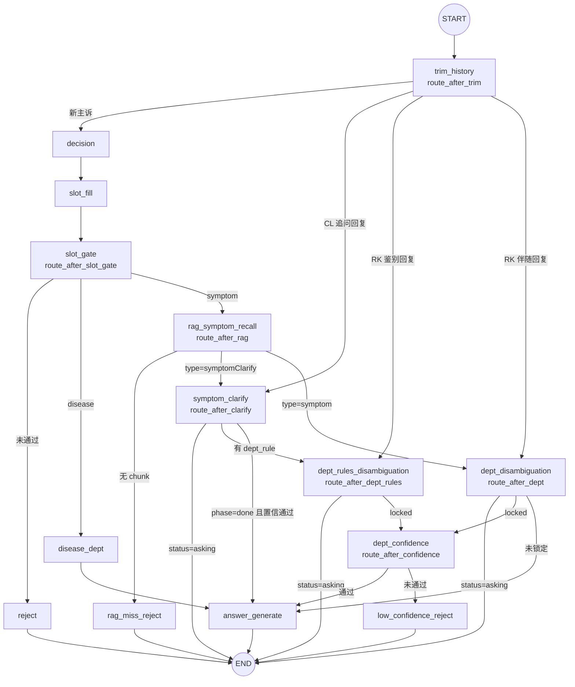

# 生产级医院导诊 Agentic 助手

基于 FastAPI + LangGraph + Redis + OpenSearch + DashScope 的医院导诊助手，提供 Rich CLI 多轮对话前端。

后端通过 LangGraph 状态机编排多轮对话、症状问诊、流程检索与意图识别，前端则以 CLI 形式演示多会话聊天体验（类似 ChatGPT 的会话列表）。

---

## 项目结构

```text
app/
  main.py                      # FastAPI 入口（/healthz、/ready）
  api/routers/                 # chat、threads、users
  core/                        # config、logging、llm（DashScope 兼容）
  domain/                      # AppState、routing、槽位/澄清/消歧模型
  graph/
    builder.py                 # LangGraph 主图编译
    nodes/                     # decision、slot_*、rag、clarify、dept_*、answer…
  infra/
    opensearch_rag.py          # OpenSearch 症状混合检索
    opensearch_disease_kb.py   # 疾病库检索
    opensearch_dept_rules.py   # 科室规则检索 + 本地 JSONL fallback
    disease_kb_store.py        # disease_kb.jsonl 加载
    redis_client.py            # Redis Checkpointer / MemorySaver 回退
    triage_session_store.py    # SQLite 导诊周期持久化
  ner/                         # 实体抽取、三分类路由
  triage/                      # 槽位填充、科室打分、规则打分、置信度
  sessions/manager.py          # 多会话元数据（Redis）
  services/
    chat_service.py            # API ↔ LangGraph 编排入口
    triage_recorder.py         # 完整导诊周期写入 SQLite

cli.py                         # Rich CLI 前端
sourceData/                    # 知识库 JSONL + OpenSearch 入库脚本
  data/                        # rag_knowledge、disease_kb、rag_department_rules…
  opensearch_rag_kb.py
  opensearch_disease_kb.py
  opensearch_dept_rules.py
scripts/                       # dev-services、repair_triage_fragments、评估脚本
tests/                         # 单元测试、run_eval 黄金用例
data/triage_sessions.db        # 导诊会话记录（运行时生成）
```

---

## 核心架构概览

一次 `/chat` 请求的链路：**CLI → FastAPI → `chat_service` → LangGraph（读/写 Checkpoint）→ OpenSearch / LLM → 回复；同时 `triage_recorder` 异步写入 SQLite**。

### 系统分层

```mermaid
flowchart TB
    subgraph L1["① 客户端"]
        CLI["cli.py<br/>Rich · 斜杠命令 · 多轮选项"]
    end

    subgraph L2["② API 层 app/api"]
        CHAT["POST /chat"]
        THREADS["/threads · /users"]
        HEALTH["GET /healthz · /ready"]
    end

    subgraph L3["③ 应用服务"]
        CS["chat_service<br/>pre_state · stream · 组装响应"]
        TR["triage_recorder<br/>完整导诊周期"]
        SM["SessionManager<br/>会话列表 / 当前 thread"]
    end

    subgraph L4["④ 编排与领域"]
        LG["LangGraph<br/>14 节点 · AppState"]
        NER["app/ner<br/>实体 · 三分类路由"]
        TRI["app/triage<br/>槽位 · 打分 · 置信度"]
        RT["app/domain/routing<br/>条件边"]
    end

    subgraph L5["⑤ 基础设施 app/infra · core/llm"]
        OS["OpenSearch 客户端"]
        RD["Redis Checkpointer<br/>或 MemorySaver"]
        SQ["SQLite triage_sessions"]
        LLM["DashScope Chat / Embedding"]
    end

    subgraph L6["⑥ 数据"]
        IDX[("索引<br/>rag_knowledge · disease_kb · rag_department_rules")]
        JSONL[("sourceData/data<br/>JSONL 源文件")]
    end

    CLI --> CHAT & THREADS
    CHAT --> CS
    THREADS --> SM
    CS --> LG
    CS --> TR
    LG --> NER & TRI & RT
    LG --> OS & LLM
    LG <-->|Checkpoint| RD
    SM --> RD
    TR --> SQ
    OS --> IDX
    JSONL -.opensearch_*.py 入库.-> IDX
    HEALTH --> OS & RD & SQ & LG
```

| 层级 | 目录 / 模块 | 职责 |
|------|-------------|------|
| 客户端 | `cli.py` | 调用 REST API；渲染 Markdown；处理 `awaiting_clarify` / `awaiting_dept_choice` 多轮选项 |
| API | `app/api/routers` | 请求校验与响应序列化；`/ready` 聚合 OpenSearch、Redis、SQLite、LangGraph 状态 |
| 应用服务 | `chat_service` | 唯一对话入口：读 Checkpoint 判追问、stream 主图、提取回复 |
| 应用服务 | `triage_recorder` | 非阻塞记录导诊周期（`turns_json`、outcome、state 快照） |
| 应用服务 | `SessionManager` | `user_id` ↔ 多 `thread_id` 元数据（标题、活跃时间） |
| 编排 | `app/graph` | 编译 StateGraph；节点见 `builder.py` |
| 领域 | `ner` / `triage` / `domain` | 与图节点解耦的业务规则：NER、槽位、科室打分、路由谓词 |
| 基础设施 | `infra` + `core/llm` | 外部 I/O：检索、持久化、模型调用 |
| 数据 | OpenSearch + JSONL | 运行时查索引；开发态改 JSONL 后重新入库 |

### LangGraph 导诊主图

编译入口：`app/graph/builder.py` → `build_app(checkpointer)`。状态类型：`AppState`（messages、intent、槽位、clarify/dept 状态、RAG 结果等）。条件路由集中在 `app/domain/routing.py`。

**14 个节点**

| 节点 | 文件 | 作用 |
|------|------|------|
| `trim_history` | `nodes/trim_history.py` | 裁剪历史；多轮追问时跳过 `decision` |
| `decision` | `nodes/decision.py` | NER + 三分类 `disease` / `symptom` / `reject` |
| `slot_fill` | `nodes/slot_fill.py` | 从用户句填充槽位表 |
| `slot_gate` | `nodes/slot_gate.py` | 槽位门禁，未通过则拒答 |
| `disease_dept` | `nodes/disease_dept.py` | 疾病 → 科室（OpenSearch / JSONL） |
| `rag_symptom_recall` | `nodes/rag_symptom_recall.py` | 症状混合召回 CL / RK |
| `symptom_clarify` | `nodes/symptom_clarify.py` | CL 多轮：年龄 / 性别 / 部位 / 红旗 |
| `dept_rules_disambiguation` | `nodes/dept_rules_disambiguation.py` | RK 鉴别项多选打分 |
| `dept_disambiguation` | `nodes/dept_disambiguation.py` | 伴随症状消歧（单选/多选） |
| `dept_confidence` | `nodes/dept_confidence.py` | LLM 评估科室推荐置信度 |
| `answer_generate` | `nodes/answer.py` | 生成最终导诊回复 |
| `reject` | `nodes/reject.py` | 槽位/意图拒答 |
| `rag_miss_reject` | `nodes/rag_miss_reject.py` | RAG 未召回拒答 |
| `low_confidence_reject` | `nodes/dept_confidence.py` | 置信度不足拒答 |

**总览（条件边）**



**典型症状链路（CL → RK）**

```text
用户主诉
  → trim_history → decision → slot_fill → slot_gate
  → rag_symptom_recall（命中 CL）
  → symptom_clarify（age → sex → pain_location …，每轮 END 等待用户）
  → dept_rules_disambiguation（鉴别多选，每轮 END 等待用户）
  → dept_confidence → answer_generate → END
```

**典型症状链路（直接 RK 伴随消歧）**

```text
  → rag_symptom_recall（命中 RK symptom）
  → dept_disambiguation（伴随症状，每轮 END 等待用户）
  → dept_confidence 或 answer_generate → END
```

### 各层职责

- **接口层（`app/api`）**：`/chat` 单轮对话；`/threads` 多会话；`/healthz`、`/ready` 依赖检查。
- **服务层（`app/services`）**
  - `chat_service`：读 Checkpoint、invoke LangGraph、返回回复与待选状态。
  - `triage_recorder`：按导诊周期追加 `turns_json`，终态写入 `data/triage_sessions.db`。
- **图编排（`app/graph`）**：14 个节点，条件路由见 `app/domain/routing.py`。
- **NER / 导诊规则（`app/ner`、`app/triage`）**：实体抽取、路由、槽位、科室打分、规则打分、置信度 prompt。
- **基础设施（`app/infra`）**
  - **OpenSearch**：`rag_knowledge`、`disease_kb`、`rag_department_rules` 三索引。
  - **Redis**：LangGraph Checkpoint + 会话列表（可 `USE_MEMORY_CHECKPOINTER=true` 回退内存）。
  - **SQLite**：导诊评估用会话库（`TRIAGE_SESSION_ENABLED`）。
  - **sourceData**：JSONL 源数据与入库脚本；运行时 fallback 读本地 JSONL。
- **客户端（`cli.py`）**：Rich 交互、斜杠命令、科室/澄清选项多轮输入。

---

## 配置与环境变量

核心环境变量集中在 `app/core/config.py` 中，项目会通过 `python-dotenv` 自动加载 `.env` 文件。

必填：

- `DASHSCOPE_API_KEY`：DashScope 兼容 OpenAI API 的密钥。

---

## 一键启动（Windows 本地开发）

`start-dev.cmd` / `start-dev.ps1` 转发到 `scripts/dev-services.ps1`，默认依次拉起：

1. **Redis**（Docker，`sourceData/redis/docker-compose.yaml`，可在配置中禁用）
2. **Triage SQLite** 初始化（`data/triage_sessions.db`）
3. **OpenSearch**（本地 zip，`esTools/...`）
4. **FastAPI**（后台，`logs/api.log`）
5. 可选验证：Redis、`/ready`、`rag_knowledge` 文档数等

### 前置准备（首次）

| 项 | 说明 |
|----|------|
| **Python 3.11** | 推荐 [uv](https://docs.astral.sh/uv/) + 项目根目录下 `.venv` |
| **OpenSearch 2.19** | 解压到 `esTools\opensearch-2.19.1-windows-x64\opensearch-2.19.1`（改 `scripts/dev-services.config.ps1` → `OpenSearch.Home`） |
| **DashScope API Key** | `copy .env.example .env`，填入 `DASHSCOPE_API_KEY` |
| **Docker Desktop** | 一键脚本默认启 Redis；无 Docker 时在 `.env` 设 `USE_MEMORY_CHECKPOINTER=true`，并在配置中设 `Redis.Enabled = $false` |

在项目根目录执行（首次）：

```powershell
# 1. Python 环境
uv venv --python 3.11
uv pip install -r requirements.txt

# 2. 环境变量
copy .env.example .env
# 编辑 .env，至少填入 DASHSCOPE_API_KEY

# 3. OpenSearch 入库（首次 / 知识库变更后；需 OpenSearch 已启动）
$env:PYTHONPATH = "."
.\.venv\Scripts\python.exe sourceData\opensearch_rag_kb.py --no-embed
.\.venv\Scripts\python.exe sourceData\opensearch_disease_kb.py --no-embed
.\.venv\Scripts\python.exe sourceData\opensearch_dept_rules.py
# 含向量混合检索时去掉 --no-embed（需消耗 Embedding 额度）
```

### 常用命令

在项目根目录执行：

```powershell
# 启动全部服务 + 健康检查（默认）
.\start-dev.cmd
# 或
.\start-dev.ps1

# 只看状态（OpenSearch / Redis / API / TriageDb）
.\start-dev.ps1 -Action status

# 只跑验证
.\start-dev.ps1 -Action verify

# 启动但不验证（更快）
.\start-dev.ps1 -Action start -SkipVerify

# 停止 API、OpenSearch、Dashboards、Redis
.\start-dev.ps1 -Action stop
```

若 PowerShell 禁止执行脚本，用：`powershell -ExecutionPolicy Bypass -File .\start-dev.ps1`

启动成功后：

| 入口 | 地址 |
|------|------|
| API 文档 | http://127.0.0.1:8000/docs |
| 健康检查 | http://127.0.0.1:8000/healthz |
| 就绪检查 | http://127.0.0.1:8000/ready |
| OpenSearch | http://127.0.0.1:9200 |
| CLI 对话 | 新开终端：`.\.venv\Scripts\python.exe cli.py` |

### 配置与日志

改路径、端口、开关：编辑 **`scripts/dev-services.config.ps1`**（无需改启动脚本本身）。

| 配置块 | 作用 |
|--------|------|
| `OpenSearch` | 本地 zip 路径、`Url`、启动等待秒数 |
| `Redis` | 是否启用、`sourceData\redis\docker-compose.yaml`、端口 |
| `TriageDb` | SQLite 路径、启动时是否 `init_schema` |
| `Api` | 监听地址/端口、后台 `--reload`（默认关） |
| `Dashboards` | 可选 OpenSearch Dashboards |
| `Verify` | 启动后检查项（OpenSearch、`/ready`、索引文档数、Chat 冒烟等） |
| `Logs.Dir` | 日志目录（默认 `logs/`） |

日志：`logs/opensearch.log`、`logs/api.log`。

### 前台调试 API（热重载）

改代码时建议前台跑 API（会先释放 8000 端口）：

```powershell
powershell -ExecutionPolicy Bypass -File scripts\start-api.ps1
```

等价于：

```text
uvicorn app.main:app --host 0.0.0.0 --port 8000 --reload --reload-dir app
```

### 可选：单独启动 Redis

一键脚本已含 Redis。若仅手动启 Redis：

```powershell
docker compose -f sourceData/redis/docker-compose.yaml up -d
```

`.env` 保持 `REDIS_URI=redis://127.0.0.1:6379`、`USE_MEMORY_CHECKPOINTER=false`，然后重启 API。

---

## 本地开发与运行（手动分步）

若不使用一键脚本，可按以下步骤操作。

### 0. 前置准备

- Python 3.11+（推荐 uv + `.venv`）
- OpenSearch 2.x（或兼容 ES API 的检索服务）
- DashScope API Key
- Redis / Milvus 为可选项

### 1. 安装依赖

```powershell
uv venv --python 3.11
uv pip install -r requirements.txt
```

### 2. RAG 数据入库（OpenSearch）

```powershell
$env:PYTHONPATH = "."
.\.venv\Scripts\python.exe sourceData\opensearch_rag_kb.py
.\.venv\Scripts\python.exe sourceData\opensearch_disease_kb.py
```

数据文件：`sourceData/data/rag_knowledge.jsonl`、`sourceData/data/disease_kb.jsonl`。

### 3. 启动后端

```powershell
$env:PYTHONPATH = "."
.\.venv\Scripts\uvicorn.exe app.main:app --host 127.0.0.1 --port 8000 --reload
```

### 4. 运行 CLI

```powershell
.\.venv\Scripts\python.exe cli.py
```

常用命令：`/help`、`/threads`、`/new`、`/switch`、`/delete`、`/user`、`/exit`。

---

## API 简要说明

仅列出核心接口，详细字段可通过代码或自动文档（FastAPI Swagger）查看。

- `POST /chat`
  - 请求体：`{ user_id: string, thread_id?: string, message: string }`
  - 响应体（简化）：  
    - `user_id`: 用户 ID  
    - `thread_id`: 当前会话 ID  
    - `reply`: 助手回复文本（Markdown）  
    - `intent_result`: 意图识别结果（是否为症状/流程/混合等）  
    - `used_docs.medical` / `used_docs.process`: 本轮使用到的文档列表

- `GET /threads?user_id=...`
- `POST /threads`
- `DELETE /threads/{thread_id}?user_id=...`
- `GET /threads/current?user_id=...`
- `POST /threads/switch`

- `POST /users`
- `GET /users/{user_id}`

- `GET /healthz`

---

## 适用场景与扩展方向

- 医院导诊 / 分诊问答机器人。
- 医院内部流程、制度、规则的问答助手。
- 其他垂直领域（如保险、政务）的 Agentic RAG 助手参考实现。

可以进一步扩展的方向：

- 替换/增加更多 LLM 提供商或模型。
- 增加工具调用节点（如挂号、检查预约、费用查询）。
- 接入 Web 前端或小程序前端。
- 增强监控与日志分析，接入 APM / tracing。

---

## 说明

本项目主要用于展示「生产级医院导诊 Agentic 助手」的整体设计与实现思路，涉及的医学内容仅为技术演示示例，不构成任何医疗建议或诊断依据，请勿用于真实诊疗决策。
