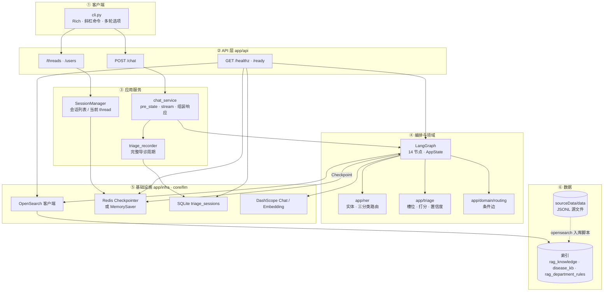

# 生产级医院导诊 Agentic 助手

基于 FastAPI + LangGraph + Redis + OpenSearch + DashScope 的医院导诊助手，提供 Rich CLI 多轮对话前端。

后端通过 LangGraph 状态机编排多轮对话、症状问诊、流程检索与意图识别，前端则以 CLI 形式演示多会话聊天体验（类似 ChatGPT 的会话列表）。

## 演示录屏


---

## 项目结构

```text
app/
  main.py                      # FastAPI 入口（/healthz、/ready）
  api/routers/                 # chat、threads、users
  core/                        # config、logging、llm（DashScope 兼容）
  domain/                      # AppState、routing、槽位/澄清/消歧模型
  graph/
    builder.py                 # LangGraph 主图编译
    nodes/                     # decision、slot_*、rag、clarify、dept_*、answer…
  infra/
    opensearch_rag.py          # OpenSearch 症状混合检索
    opensearch_disease_kb.py   # 疾病库检索
    opensearch_dept_rules.py   # 科室规则检索 + 本地 JSONL fallback
    disease_kb_store.py        # disease_kb.jsonl 加载
    redis_client.py            # Redis Checkpointer / MemorySaver 回退
    triage_session_store.py    # SQLite 导诊周期持久化
  ner/                         # 实体抽取、三分类路由
  triage/                      # 槽位填充、科室打分、规则打分、置信度
  sessions/manager.py          # 多会话元数据（Redis）
  services/
    chat_service.py            # API ↔ LangGraph 编排入口
    triage_recorder.py         # 完整导诊周期写入 SQLite

cli.py                         # Rich CLI 前端
sourceData/                    # 知识库 JSONL + OpenSearch 入库脚本
  data/                        # rag_knowledge、disease_kb、rag_department_rules…
  opensearch_rag_kb.py
  opensearch_disease_kb.py
  opensearch_dept_rules.py
scripts/                       # dev-services、repair_triage_fragments、评估脚本
tests/                         # 单元测试、run_eval 黄金用例
data/triage_sessions.db        # 导诊会话记录（运行时生成）
```

---

## 核心架构概览

一次 `/chat` 请求的链路：**CLI → FastAPI → `chat_service` → LangGraph（读/写 Checkpoint）→ OpenSearch / LLM → 回复；同时 `triage_recorder` 异步写入 SQLite**。

### 系统分层



| 层级 | 目录 / 模块 | 职责 |
|------|-------------|------|
| 客户端 | `cli.py` | 调用 REST API；渲染 Markdown；处理 `awaiting_clarify` / `awaiting_dept_choice` 多轮选项 |
| API | `app/api/routers` | 请求校验与响应序列化；`/ready` 聚合 OpenSearch、Redis、SQLite、LangGraph 状态 |
| 应用服务 | `chat_service` | 唯一对话入口：读 Checkpoint 判追问、stream 主图、提取回复 |
| 应用服务 | `triage_recorder` | 非阻塞记录导诊周期（`turns_json`、outcome、state 快照） |
| 应用服务 | `SessionManager` | `user_id` ↔ 多 `thread_id` 元数据（标题、活跃时间） |
| 编排 | `app/graph` | 编译 StateGraph；节点见 `builder.py` |
| 领域 | `ner` / `triage` / `domain` | 与图节点解耦的业务规则：NER、槽位、科室打分、路由谓词 |
| 基础设施 | `infra` + `core/llm` | 外部 I/O：检索、持久化、模型调用 |
| 数据 | OpenSearch + JSONL | 运行时查索引；开发态改 JSONL 后重新入库 |

---

## 配置与环境变量

核心环境变量集中在 `app/core/config.py` 中，项目会通过 `python-dotenv` 自动加载 `.env` 文件。

必填：

- `DASHSCOPE_API_KEY`：DashScope 兼容 OpenAI API 的密钥。

---

## 启动方式

| | **A — Windows** | **B — Linux** |
|--|-----------------|---------------|
| 方式 | 本机混合开发（`start-dev.ps1`） | 全 Docker（`docker compose`） |
| 组件 | 本机 OpenSearch + 本机/Docker Redis + 本机 API | 容器内 API + Redis + OpenSearch |
| 适合 | 日常改 Python、热重载、调试 | 部署、演示 |

**同一台机器上不要同时跑 A 和 B**（会抢 `8000` / `6379` / `9200`）。切换前先停止当前方式。

### 共用前置

```bash
cp .env.example .env    # Windows: copy .env.example .env
# 编辑 .env，至少填入 DASHSCOPE_API_KEY
```

**知识库入库**（OpenSearch 已就绪后，首次或 JSONL 变更时；去掉 `--no-embed` 可走向量检索）：

```bash
export PYTHONPATH=. ES_URL=http://localhost:9200
# Windows PowerShell: $env:PYTHONPATH="."; $env:ES_URL="http://localhost:9200"

.venv/bin/python sourceData/opensearch_rag_kb.py --no-embed
.venv/bin/python sourceData/opensearch_disease_kb.py --no-embed
.venv/bin/python sourceData/opensearch_dept_rules.py
# Windows 将 .venv/bin/python 换为 .\.venv\Scripts\python.exe
```

---

### A — Windows 本地开发

**依赖：** Python 3.11 + `.venv`（推荐 [uv](https://docs.astral.sh/uv/)）、OpenSearch 2.19 Windows zip、DashScope Key。

```powershell
uv venv --python 3.11
uv pip install -r requirements.txt
# OpenSearch 解压到 scripts/dev-services.config.ps1 → OpenSearch.Home
# 默认: esTools\opensearch-2.19.1-windows-x64\opensearch-2.19.1
```

`start-dev.ps1` 依次拉起 Redis（默认 Windows 本机）、Triage SQLite、OpenSearch、后台 API，并验证 `/ready` 等。

```powershell
.\start-dev.ps1                    # 启动
.\start-dev.ps1 -Action status     # 状态
.\start-dev.ps1 -Action stop       # 停止

.\scripts\start-api.ps1            # 另开终端：前台 API + 热重载
.\.venv\Scripts\python.exe cli.py  # 另开终端：CLI
```

无 Redis：`.env` 设 `USE_MEMORY_CHECKPOINTER=true`，`dev-services.config.ps1` 设 `Redis.Enabled = $false`。

---

### B — Linux（Docker）

**依赖：** Docker Engine / Compose、DashScope Key；入库或 CLI 时需 Python 3.11 + `.venv`。

```bash
uv venv --python 3.11 && uv pip install -r requirements.txt   # 仅入库 / CLI

docker compose up -d --build
docker compose logs -f api
docker compose down        # 停止
docker compose down -v     # 停止并清数据卷
```

`docker-compose.override.yml` 在 `docker compose` 时自动合并（热重载、debug 日志）。API：`http://localhost:8000`（`/docs`、`/healthz`、`/ready`）。

```bash
.venv/bin/python cli.py    # 另开终端：CLI
```

---

### Web 前端（A / B 的 API 就绪后）

```bash
cd front_Web
cp .env.example .env       # Windows: copy .env.example .env
npm install
npm run dev
```

开发环境走 `/api` 代理到 `127.0.0.1:8000`。