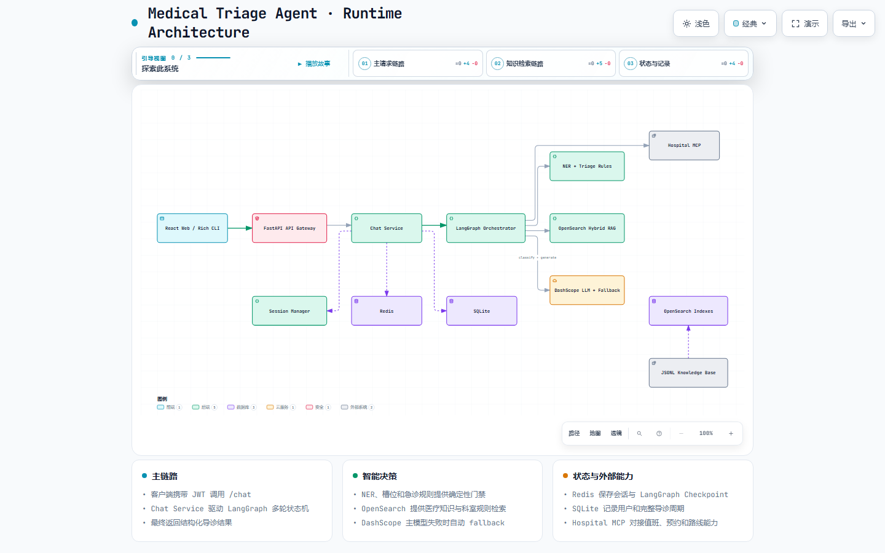

# 生产级医院导诊 Agentic 助手

基于 FastAPI + LangGraph + Redis + OpenSearch + DashScope 的医院导诊助手，提供 **Web 登录演示** 与 **Rich CLI** 多轮对话前端。

后端通过 LangGraph 状态机编排多轮对话、症状问诊、流程检索与意图识别；网关层提供 JWT/微信鉴权、限流与结构化错误响应；LLM 支持主备模型 fallback 与整体超时兜底。前端 Web 支持手机号登录与会话管理，CLI 则以多会话聊天形式演示完整导诊链路。

## 演示录屏


---

## 项目结构

```text
app/
  main.py                      # FastAPI 入口（/healthz、/ready、异常处理器注册）
  api/routers/                 # auth、chat、threads、users（users 已废弃）
  gateway/                     # JWT 鉴权、限流、手机号归一化、全局异常处理
    deps.py                    # get_current_user 依赖注入
    jwt.py                     # Access/Refresh Token 签发与校验
    rate_limit.py              # slowapi 限流（chat 可配置开关）
    exception_handlers.py        # 422/429/500 结构化响应
    phone.py · whitelist.py · errors.py
  core/                        # config、logging、llm（DashScope 主备 fallback）
  domain/                      # AppState、routing、槽位/澄清/消歧/急诊门禁模型
  graph/
    builder.py                 # LangGraph 主图编译（17 节点）
    nodes/
      trim_history、decision、slot_fill、emergency_gate、slot_gate
      disease_dept、rag_symptom_recall、symptom_clarify
      dept_rules_disambiguation、dept_disambiguation、dept_confidence
      fetch_oncall、mcp_followup、answer_generate、reject…
  infra/
    es_client.py               # OpenSearch 连接
    opensearch_rag.py          # 症状混合检索（BM25 + KNN）
    rag_hybrid_search.py       # 混合检索 pipeline 共享逻辑
    opensearch_disease_kb.py   # 疾病库检索
    opensearch_dept_rules.py   # 科室规则检索 + 本地 JSONL fallback
    disease_kb_store.py        # disease_kb.jsonl 加载
    redis_client.py            # Redis Checkpointer / MemorySaver 回退
    redis_compat.py            # Redis 版本兼容
    triage_session_store.py    # SQLite 导诊周期持久化
    token_store.py             # Redis Refresh Token 轮换
    user_store.py              # SQLite 用户库（手机号 + 密码）
    wechat_client.py           # 微信小程序 code2session / 手机号解密
  mcp/
    client.py                  # MCP Stdio 客户端（值班/科室介绍/路线）
    followup.py                # 追问意图 → MCP 工具调用
  ner/                         # 实体抽取、三分类路由
  triage/                      # 槽位填充、科室打分、急诊规则、session_reset
  sessions/manager.py          # 多会话元数据（Redis）
  services/
    chat_service.py            # API ↔ LangGraph 编排入口（含 chat_once_async 超时兜底）
    triage_recorder.py         # 完整导诊周期写入 SQLite

hospital_mcp/                  # 医院 HIS MCP 服务（Mock）
  server.py                    # get_oncall_appointments · intro · route
  adapters/mock_store.py
  mock/                        # departments.json、routes.json

mcp_server/server.py           # 兼容启动入口 → hospital_mcp

cli.py                         # Rich CLI 前端（--phone / --password / --token）
front_Web/                     # React + Vite Web 前端
  src/                         # AuthPage、components、hooks、lib/api.ts · auth.ts
sourceData/                    # 知识库 JSONL + OpenSearch 入库脚本
  data/                        # rag_knowledge、disease_kb、rag_department_rules…
  opensearch_rag_kb.py
  opensearch_disease_kb.py
  opensearch_dept_rules.py
scripts/                       # dev-services、auth_helper、评估脚本、数据生成
tests/                         # 25+ pytest 模块（路由/RAG/JWT/限流/超时/fallback…）
data/triage_sessions.db        # 导诊会话记录（运行时生成）
```

---

## 核心架构概览

一次 `/chat` 请求的链路：**客户端（带 JWT）→ API Gateway（鉴权/限流）→ `chat_service.chat_once_async`（整体超时兜底）→ LangGraph（读/写 Checkpoint）→ OpenSearch / LLM（主备 fallback）→ 回复；同时 `triage_recorder` 异步写入 SQLite**。

### 系统分层



这张图由 Archify 从本地项目结构生成，展示客户端、FastAPI 网关、Chat Service、LangGraph、RAG/LLM、Hospital MCP 以及 Redis/SQLite/OpenSearch 的运行时关系。查看 [交互式架构图](docs/architecture/medical-agent.runtime.architecture.html) 或 [Archify JSON 定义](docs/architecture/medical-agent.runtime.architecture.json)。

---

## 配置与环境变量

核心环境变量集中在 `app/core/config.py` 中，项目会通过 `python-dotenv` 自动加载 `.env` 文件。

必填：

- `DASHSCOPE_API_KEY`：DashScope 兼容 OpenAI API 的密钥。

### 模型与可靠性

| 变量 | 说明 | 默认 |
|------|------|------|
| `CHAT_MODEL_NAME` | 主对话模型 | `qwen3.6-flash` |
| `CHAT_FALLBACK_MODEL_NAME` | 主模型失败时回退模型 | `deepseek-v4-flash` |
| `CHAT_TIMEOUT_SECONDS` | `/chat` 整体超时（秒）；超时返回 HTTP 200 + `timed_out=true` | `60` |
| `LLM_TIMEOUT` | 单次 LLM HTTP 超时（秒） | `60` |

主模型 invoke/ainvoke/structured_output 失败时自动切换备模型；`chat_once_async` 用 `asyncio.wait_for` 包住整条 LangGraph 链路，避免单请求无限挂起。

### 鉴权相关（JWT / 微信 / 限流）

`.env.example` 中已列出网关层变量，生产环境务必修改 `JWT_SECRET`：

| 变量 | 说明 | 默认 |
|------|------|------|
| `JWT_SECRET` | HS256 签名密钥 | `dev-only-change-me` |
| `JWT_ACCESS_EXPIRE_MINUTES` | Access Token 有效期（分钟） | `120` |
| `JWT_REFRESH_EXPIRE_DAYS` | Refresh Token 有效期（天） | `7` |
| `WECHAT_APP_ID` / `WECHAT_APP_SECRET` | 微信小程序 `code2session` / 手机号解密 | 空（未配置时微信端点返回 503） |
| `CORS_ORIGINS` | 允许的跨域来源 | `http://localhost:5173,https://servicewechat.com` |
| `RATE_LIMIT_CHAT` | `/chat` 限额；**空字符串 = 关闭**（便于本地评测） | `""`（关闭） |
| `RATE_LIMIT_READ` | `/threads/*`、`/auth/me` 限额 | `60/minute` |
| `RATE_LIMIT_AUTH_IP` | 公开 `/auth/*` 按 IP 限额 | `10/minute` |
| `MAX_REFRESH_PER_PHONE` | 每手机号活跃 Refresh 数上限 | `3` |

**Breaking change：** 自网关改造起，`/chat` 与 `/threads/*` 必须携带 `Authorization: Bearer <access_token>`。客户端传入的 `user_id` 不再作为身份依据（服务端从 JWT `sub` 注入，即 E.164 手机号）。旧 `POST|GET /users` 已废弃，请改用 `/auth/register` 与 `/auth/me`。

**Web 登录：** `front_Web` 启动后使用手机号 + 密码注册/登录；Axios 拦截器自动附加 Bearer 并在 401 时尝试 `/auth/refresh`。

**CLI：**

```powershell
# 交互式登录（会提示手机号与密码）
.\.venv\Scripts\python.exe cli.py

# 非交互
.\.venv\Scripts\python.exe cli.py --phone 13800138000 --password yourpass123

# 直接使用已有 token（跳过登录）
.\.venv\Scripts\python.exe cli.py --token eyJ...
```

**curl 示例：**

```bash
# 注册
curl -s -X POST http://localhost:8000/auth/register \
  -H "Content-Type: application/json" \
  -d '{"phone":"13800138000","password":"testpass123","display_name":"Demo"}'

# 登录
curl -s -X POST http://localhost:8000/auth/login \
  -H "Content-Type: application/json" \
  -d '{"phone":"13800138000","password":"testpass123"}'

# 带 token 发消息（body 无需 user_id）
TOKEN="<access_token>"
curl -s -X POST http://localhost:8000/chat \
  -H "Authorization: Bearer $TOKEN" \
  -H "Content-Type: application/json" \
  -d '{"message":"头痛三天了"}'

# 当前用户
curl -s http://localhost:8000/auth/me -H "Authorization: Bearer $TOKEN"
```

**微信小程序 API 契约**（`wx.login` → 手机号授权 → Bearer 请求）见设计文档 [§3.1](docs/superpowers/specs/2026-07-04-api-gateway-jwt-wechat-ratelimit-design.md#31-微信小程序)。评估脚本使用 `scripts/auth_helper.py`：`register_or_login()` / `authed_session()`；默认 eval 账号 `13900000001` / `eval-pass-123`（首次运行自动注册）。

---

## 启动方式

| | **A — Windows** | **B — Linux** |
|--|-----------------|---------------|
| 方式 | 本机混合开发（`start-dev.ps1`） | 全 Docker（`docker compose`） |
| 组件 | 本机 OpenSearch + 本机/Docker Redis + 本机 API | 容器内 API + Redis + OpenSearch |
| 适合 | 日常改 Python、热重载、调试 | 部署、演示 |

**同一台机器上不要同时跑 A 和 B**（会抢 `8000` / `6379` / `9200`）。切换前先停止当前方式。

### 共用前置

```bash
cp .env.example .env    # Windows: copy .env.example .env
# 编辑 .env，至少填入 DASHSCOPE_API_KEY
```

**知识库入库**（OpenSearch 已就绪后，首次或 JSONL 变更时；去掉 `--no-embed` 可走向量检索）：

```bash
export PYTHONPATH=. ES_URL=http://localhost:9200
# Windows PowerShell: $env:PYTHONPATH="."; $env:ES_URL="http://localhost:9200"

.venv/bin/python sourceData/opensearch_rag_kb.py --no-embed
.venv/bin/python sourceData/opensearch_disease_kb.py --no-embed
.venv/bin/python sourceData/opensearch_dept_rules.py
# Windows 将 .venv/bin/python 换为 .\.venv\Scripts\python.exe
```

---

### A — Windows 本地开发

**依赖：** Python 3.11 + `.venv`（推荐 [uv](https://docs.astral.sh/uv/)）、OpenSearch 2.19 Windows zip、DashScope Key。

```powershell
uv venv --python 3.11
uv pip install -r requirements.txt
# OpenSearch 解压到 scripts/dev-services.config.ps1 → OpenSearch.Home
# 默认: esTools\opensearch-2.19.1-windows-x64\opensearch-2.19.1
```

`start-dev.ps1` 依次拉起 Redis（默认 Windows 本机）、Triage SQLite、OpenSearch、后台 API，并验证 `/ready` 等。

```powershell
.\start-dev.ps1                    # 启动
.\start-dev.ps1 -Action status     # 状态
.\start-dev.ps1 -Action stop       # 停止

.\scripts\start-api.ps1            # 另开终端：前台 API + 热重载后台
.\.venv\Scripts\python.exe cli.py  # 另开终端：CLI
```

无 Redis：`.env` 设 `USE_MEMORY_CHECKPOINTER=true`，`dev-services.config.ps1` 设 `Redis.Enabled = $false`。

---

### B — Linux（Docker）

**依赖：** Docker Engine / Compose、DashScope Key；入库或 CLI 时需 Python 3.11 + `.venv`。

```bash
uv venv --python 3.11 && uv pip install -r requirements.txt   # 仅入库 / CLI

docker compose up -d --build
docker compose logs -f api
docker compose down        # 停止
docker compose down -v     # 停止并清数据卷
```

`docker-compose.override.yml` 在 `docker compose` 时自动合并（热重载、debug 日志）。API：`http://localhost:8000`（`/docs`、`/healthz`、`/ready`）。

```bash
.venv/bin/python cli.py    # 另开终端：CLI
```

---

### Web 前端（A / B 的 API 就绪后）

```bash
cd front_Web
cp .env.example .env       # Windows: copy .env.example .env
npm install
npm run dev
```

开发环境走 `/api` 代理到 `127.0.0.1:8000`。

---

## 高层运行时架构（Archify）

下面这张静态图可直接在 GitHub README 中渲染：


需要交互式查看、切换深色主题或追踪调用路径时，打开 [Archify 交互式架构图](docs/architecture/medical-agent.runtime.architecture.html)。图的可复现定义保存在 [Archify JSON](docs/architecture/medical-agent.runtime.architecture.json)。
