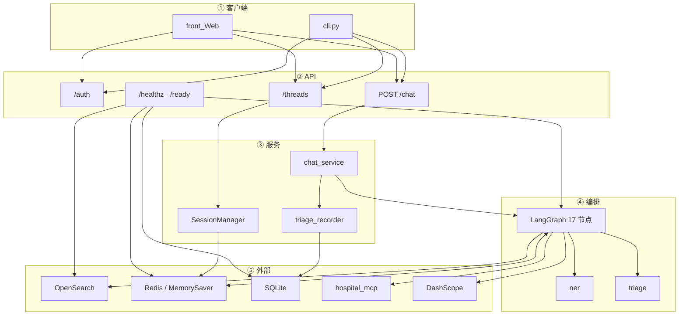

# 医院导诊 Agentic 助手

基于 **FastAPI + LangGraph + Redis + OpenSearch + DashScope** 的医院导诊助手：多轮症状问诊、科室鉴别、急诊门禁，并可通过 MCP 查询值班 / 科室介绍 / 院内路线。

客户端：`cli.py`（Rich CLI）与 `front_Web/`（React + Vite）。鉴权为 JWT（手机号注册登录；可选微信小程序）。

## 演示


---

## 项目结构

```text
app/
  main.py                 # FastAPI 入口
  api/routers/            # auth · chat · threads · health
  gateway/                # JWT、限流、异常处理、依赖注入
  core/                   # config · logging · llm（DashScope）
  domain/                 # AppState、条件路由、槽位/澄清模型
  graph/
    builder.py            # LangGraph 主图（17 节点）
    nodes/                # trim → decision → … → answer / reject
  triage/                 # 槽位、澄清、科室打分、急诊规则、选项组装
  ner/                    # 实体抽取、三分类路由
  mcp/                    # Stdio MCP 客户端与追问工具
  infra/                  # OpenSearch / Redis / SQLite / 检索
  services/               # chat_service · triage_recorder
  sessions/               # 多会话元数据（Redis）

hospital_mcp/             # 医院 HIS MCP（Mock）：值班 · 介绍 · 路线
mcp_server/server.py      # 兼容启动入口 → hospital_mcp

cli.py                    # Rich CLI
front_Web/                # Web 前端（JWT 登录、多会话、斜杠命令）
sourceData/               # JSONL 知识库 + OpenSearch 入库脚本
  data/                   # rag_knowledge · disease_kb · department_rules
  redis/                  # 路径 A 可选 Docker Redis
scripts/                  # start-api、评估、数据生成、dev-services
tests/                    # 单元测试
docs/superpowers/         # 历史设计规格（specs / plans）
```

运行时生成：`data/triage_sessions.db`（导诊周期记录，已 gitignore）。

---

## 请求链路

**客户端 → FastAPI（JWT）→ `chat_service` → LangGraph（Checkpoint）→ OpenSearch / LLM / MCP → 回复**；完整导诊周期由 `triage_recorder` 异步写入 SQLite。


```mermaid
flowchart TB
    subgraph L1["① 客户端"]
        CLI["cli.py"]
        WEB["front_Web"]
    end

    subgraph L2["② API"]
        AUTH["/auth"]
        CHAT["POST /chat"]
        THREADS["/threads"]
        HEALTH["/healthz · /ready"]
    end

    subgraph L3["③ 服务"]
        CS["chat_service"]
        TR["triage_recorder"]
        SM["SessionManager"]
    end

    subgraph L4["④ 编排"]
        LG["LangGraph 17 节点"]
        NER["ner"]
        TRI["triage"]
    end

    subgraph L5["⑤ 外部"]
        OS["OpenSearch"]
        RD["Redis / MemorySaver"]
        SQ["SQLite"]
        MCP["hospital_mcp"]
        LLM["DashScope"]
    end

    CLI & WEB --> AUTH & CHAT & THREADS
    CHAT --> CS --> LG
    CS --> TR --> SQ
    THREADS --> SM --> RD
    LG --> NER & TRI
    LG --> OS & LLM & MCP
    LG <--> RD
    HEALTH --> OS & RD & SQ & LG
```

| 层级 | 职责 |
|------|------|
| API | 校验、序列化、限流；`/ready` 聚合依赖健康状态 |
| chat_service | 唯一对话入口：追问判定、stream 主图、组装响应 |
| LangGraph | 槽位门禁、急诊、RAG 澄清、科室鉴别、置信度、MCP 追问 |
| triage / ner | 与图节点解耦的业务规则与选项构造 |
| infra | 混合检索、Checkpoint、导诊 DB |

---

## 配置

复制根目录环境模板并填写密钥：

```bash
cp .env.example .env    # Windows: copy .env.example .env
```

**必填：** `DASHSCOPE_API_KEY`

### 鉴权 / 网关（摘要）

| 变量 | 说明 | 默认 |
|------|------|------|
| `JWT_SECRET` | HS256 密钥（生产务必修改） | `dev-only-change-me…` |
| `JWT_ACCESS_EXPIRE_MINUTES` | Access Token 分钟数 | `120` |
| `JWT_REFRESH_EXPIRE_DAYS` | Refresh Token 天数 | `7` |
| `WECHAT_APP_ID` / `WECHAT_APP_SECRET` | 微信小程序；未配置时微信端点 503 | 空 |
| `CORS_ORIGINS` | 跨域来源 | 含 `localhost:5173` |
| `RATE_LIMIT_CHAT` | `/chat` 限额（空=不限） | 空 |
| `RATE_LIMIT_READ` | 读接口限额 | `60/minute` |
| `RATE_LIMIT_AUTH_IP` | 公开 `/auth/*` 按 IP | `10/minute` |
| `MAX_REFRESH_PER_PHONE` | 每手机号活跃 Refresh 上限 | `3` |

`/chat` 与 `/threads/*` 必须带 `Authorization: Bearer <access_token>`。身份取自 JWT `sub`（E.164 手机号），请求体中的 `user_id` 不再作为身份依据。

微信契约见 [API 网关设计 §3.1](docs/superpowers/specs/2026-07-04-api-gateway-jwt-wechat-ratelimit-design.md#31-微信小程序)。评估脚本用 `scripts/auth_helper.py`（默认账号 `13900000001` / `eval-pass-123`）。

**CLI 登录：**

```powershell
.\.venv\Scripts\python.exe cli.py
.\.venv\Scripts\python.exe cli.py --phone 13800138000 --password yourpass123
.\.venv\Scripts\python.exe cli.py --token eyJ...
```

**curl：**

```bash
curl -s -X POST http://localhost:8000/auth/register \
  -H "Content-Type: application/json" \
  -d '{"phone":"13800138000","password":"testpass123","display_name":"Demo"}'

TOKEN=$(curl -s -X POST http://localhost:8000/auth/login \
  -H "Content-Type: application/json" \
  -d '{"phone":"13800138000","password":"testpass123"}' | jq -r .access_token)

curl -s -X POST http://localhost:8000/chat \
  -H "Authorization: Bearer $TOKEN" \
  -H "Content-Type: application/json" \
  -d '{"message":"头痛三天了"}'
```

---

## 启动

| | **A — Windows** | **B — Linux / Docker** |
|--|-----------------|------------------------|
| 方式 | `start-dev.ps1` 本机混合开发 | `docker compose` 全容器 |
| 组件 | 本机 OpenSearch + Redis + API | API + Redis + OpenSearch |
| 适合 | 改 Python、热重载 | 部署、演示 |

**不要同时跑 A 和 B**（端口 `8000` / `6379` / `9200` 冲突）。

### 共用前置

```bash
cp .env.example .env
# 至少填入 DASHSCOPE_API_KEY
```

OpenSearch 就绪后入库（首次或 JSONL 变更；去掉 `--no-embed` 可走向量检索）：

```bash
export PYTHONPATH=. ES_URL=http://localhost:9200
.venv/bin/python sourceData/opensearch_rag_kb.py --no-embed
.venv/bin/python sourceData/opensearch_disease_kb.py --no-embed
.venv/bin/python sourceData/opensearch_dept_rules.py
```

### A — Windows

依赖：Python 3.11 + `.venv`、OpenSearch 2.19 zip、DashScope Key。

```powershell
uv venv --python 3.11
uv pip install -r requirements.txt
# OpenSearch 解压路径见 scripts/dev-services.config.ps1 → OpenSearch.Home

.\start-dev.ps1
.\start-dev.ps1 -Action status
.\start-dev.ps1 -Action stop

.\scripts\start-api.ps1            # 另开终端：前台 API
.\.venv\Scripts\python.exe cli.py  # 另开终端：CLI
```

无 Redis：`.env` 设 `USE_MEMORY_CHECKPOINTER=true`，`dev-services.config.ps1` 设 `Redis.Enabled = $false`。

### B — Docker

```bash
uv venv --python 3.11 && uv pip install -r requirements.txt   # 入库 / CLI 需要

docker compose up -d --build
docker compose logs -f api
docker compose down        # 停止
docker compose down -v     # 停止并清卷
```

API：`http://localhost:8000`（`/docs`、`/healthz`、`/ready`）。

### Web 前端

```bash
cd front_Web
cp .env.example .env
npm install
npm run dev
```

开发请求经 `/api` 代理到 `127.0.0.1:8000`。详见 [`front_Web/README.md`](front_Web/README.md)。

---

## 测试

```bash
# 后端（跳过需服务的 eval 入口）
.venv/bin/python -m pytest tests/ --ignore=tests/run_eval.py -q

# 前端
cd front_Web && npm test
```

---

## 设计文档

历史规格与实现计划在 [`docs/superpowers/`](docs/superpowers/)（JWT 网关、急诊门禁、MCP、评估轮次等）。以当前代码与本 README 为准；文档中若提及已删除路径（如旧 `users` 路由），视为历史记录。
