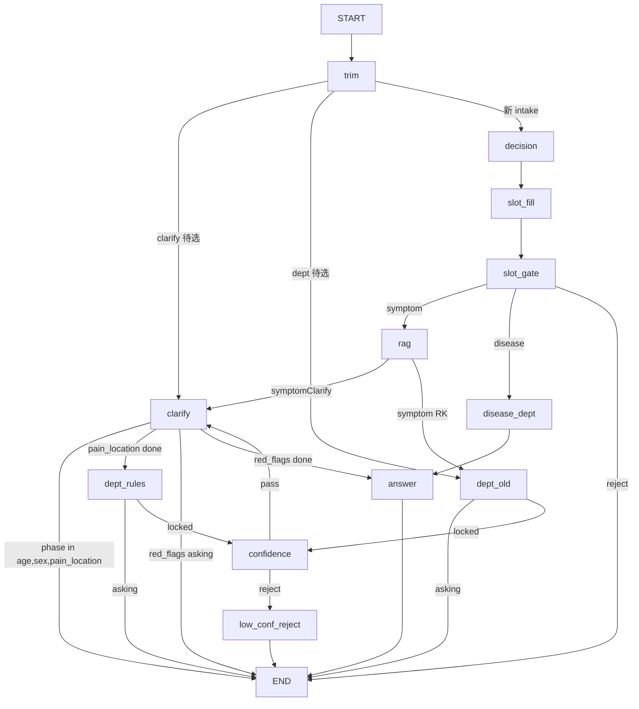

# Symptom Clarify + Department Rules 导诊设计

**日期**: 2026-06-24  
**状态**: 待实现  
**范围**: 通用框架——`symptomClarify`（CL）槽位反问 → `rag_department_rules` 多选消歧 → LLM 置信度门禁

---

## 1. 背景与目标

### 1.1 现状

- 症状链：`rag_symptom_recall` 从 `rag_knowledge` 召回 RK chunk → `dept_disambiguation` 基于 `accompanying_symptom_keywords` **单选**消歧。
- `sourceData/data/rag_knowledge.jsonl` 已含 **CL0001**（`type: symptomClarify`，腹痛别名 + `pain_location` 选项）。
- `sourceData/data/rag_department_rules.jsonl` 已含 **RK0025**（`symptom_id` + `location` + `differential_questions` 打分）。
- 代码尚未接入上述数据类型。

### 1.2 目标流程（腹痛示例）

```
用户: 肚子疼
  → 召回 CL0001
  → 反问 age → sex → pain_location
  → 用户选「右下腹」
  → 召回 RK0025（symptom_id=腹痛, location=右下腹）
  → 展示全部 differential_questions 选项（多选 +「都没有」）
  → 累加打分 + try_lock_department 锁定科室
  → LLM 置信度评分（locked_department vs 槽位表，**不含 red_flags**）
  → score ≥ 60：反问 red_flags（仅收集）→ 输出科室建议；< 60：reject
```

### 1.3 设计决策汇总

| 项 | 决策 |
|----|------|
| 范围 | 通用可复用框架（非腹痛硬编码） |
| 多选输入 | 编号：`1,3` / `1 3` / `1、3` |
| 槽位顺序 | age → sex → pain_location → differential → red_flags |
| location 匹配 | 字面一致，**不做**归一化模块（CL 选项与 rules `location` 对齐） |
| 男性 | 排除「妇科」科室及妇科专属 differential 选项 |
| 科室锁定 | 基分 + 多选累加 → `try_lock_department`；「都没有」/低分差 fallback；平局按 `candidate_departments` 顺序取第一个 |
| red_flags | 第一期只写入 state，不影响科室推荐；**不进入** LLM 置信度 prompt |
| 置信度 | **LLM 评分**（locked_department 与 slot 表关联度，含 age/sex/pain_location/differential，**排除 red_flags**），≥60 输出，<60 reject；分数暴露于 `/chat` |
| 与脚部 RK 流程 | 并存：`type=symptom` 走现有单选消歧，同样经 LLM 置信度门禁 |

---

## 2. 架构

### 2.1 推荐方案

**分阶段状态机 + 扩展 LangGraph + 独立 `rag_department_rules` 索引**（方案 1）。

不采用：单一问卷节点（难维护）；department_rules 并入 rag_knowledge（schema 混杂）。

### 2.2 图编排



### 2.3 新增/变更节点

| 节点 | 职责 |
|------|------|
| `symptom_clarify` | 驱动 CL `required_slots` 顺序反问；填充 `SymptomClarifyState` |
| `dept_rules_recall` | 按 `symptom_id` + `location` 精确查 `rag_department_rules` |
| `dept_rules_disambiguation` | differential 多选、累加打分、锁定科室 |
| `dept_confidence` | LLM 结构化输出置信度；路由 pass/reject |
| `low_confidence_reject` | 返回拒绝话术 + 分数，不展示科室 |

### 2.4 索引

| 索引 | 数据源 | 召回方式 |
|------|--------|----------|
| `rag_knowledge`（现有） | `rag_knowledge.jsonl` | 混合检索；CL 的 `aliases` 写入 `alliance` |
| `rag_department_rules`（新） | `rag_department_rules.jsonl` | `symptom_id` + `location` term 精确匹配 |

入库脚本：`sourceData/opensearch_rag_kb.py` 同级新增 `sourceData/opensearch_dept_rules.py`（或扩展 demo 脚本）。

---

## 3. 数据模型

### 3.1 CL0001 补全（`rag_knowledge.jsonl`）

在现有 CL0001 上补充 `questions`：

```json
{
  "id": "CL0001",
  "type": "symptomClarify",
  "symptom_id": "腹痛",
  "aliases": ["肚子疼", "肚疼", "腹痛", "肚子痛"],
  "required_slots": ["age", "sex", "pain_location", "red_flags"],
  "questions": {
    "age": {
      "text": "请问您的年龄？",
      "options": ["0-3个月", "3个月-1岁", "2-4岁", "5-11岁", "12-18岁", "19-35岁", "35-59岁", "60岁及以上"]
    },
    "sex": {
      "text": "请问您的性别？",
      "options": ["男", "女"]
    },
    "pain_location": {
      "text": "你感觉主要是哪里疼？",
      "options": ["上腹部", "下腹部", "右下腹", "左下腹", "肚脐周围", "整个肚子", "说不清"]
    },
    "red_flags": {
      "text": "有没有以下情况？",
      "options": ["剧烈疼痛", "持续加重", "发热", "呕吐不止", "黑便/便血", "怀孕或可能怀孕", "外伤后腹痛", "都没有"]
    }
  }
}
```

### 3.2 RK0025（`rag_department_rules.jsonl`）

当前数据（`location: "右下腹"` 与 CL 选项一致）：

- `candidate_departments`: `["消化内科", "普外科", "妇科", "泌尿外科"]`
- `differential_questions`: 四项 + 各科 `scores`

扩展新症状/部位：追加 JSONL 行，同一 `symptom_id` 不同 `location`。

### 3.3 SymptomClarifyState

```python
class ClarifyChoice(BaseModel):
    id: str
    label: str
    slot: str | None = None
    scores: dict[str, float] | None = None  # differential 阶段

class SymptomClarifyState(BaseModel):
    status: Literal["asking", "done"]
    clarify_chunk_id: str | None
    symptom_id: str | None
    phase: Literal["age", "sex", "pain_location", "differential", "red_flags", "done"]
    filled_slots: dict[str, str]
    last_question: str | None
    last_choices: list[ClarifyChoice]
    multi_select: bool = False
    dept_rule_id: str | None
    dept_rule_chunk: dict | None
```

挂于 `AppState.clarify_state`。

### 3.4 DeptConfidenceResult

```python
class DeptConfidenceResult(BaseModel):
    score: float          # 0–100
    reason: str           # 简短理由（日志 / 可选展示）
    slot_alignment: str # locked_department 与各槽位一致性的简述
```

挂于 `AppState.dept_confidence_result`；`AppState.dept_confidence_passed: bool`。

---

## 4. 路由

### 4.1 route_after_trim

1. `clarify_state.status == "asking"` → `symptom_clarify`
2. `dept_state.status == "asking"` 且 `choice_mode == "differential"` → `dept_rules_disambiguation`
3. `dept_state.status == "asking"`（accompany 模式）→ `dept_disambiguation`
4. 否则 → `decision`

### 4.2 route_after_rag

- `rag_chunk.type == "symptomClarify"` → `symptom_clarify`（初始化 clarify_state）
- 否则 → `dept_disambiguation`

### 4.3 route_after_confidence

- `dept_confidence_passed` → `answer_generate`
- 否则 → `low_confidence_reject`

---

## 5. 业务规则

### 5.1 性别过滤（男性排除妇科）

在 `sex` 槽位确定为「男」后：

- `candidate_departments` 移除「妇科」
- 不展示 `scores` 仅指向妇科的 differential（如「月经异常、白带异常」）
- 计分与 fallback 均不在妇科池内

### 5.2 科室打分

**基分**（过滤后的 `candidate_departments`，按数组顺序 index 越小基分越高）：

```python
base[dept] = len(active_depts) - index
```

**多选累加**：用户选中项的 `scores` 累加至 `totals`（仅 `active_depts`）。

**锁定**：

1. `try_lock_department(totals)`（`MARGIN=2.0`, `LOCK_THRESHOLD=6.0`）
2. 未锁定或「都没有」：`fallback` = `totals` 最高；平局按 `candidate_departments` 顺序第一个在 `active_depts` 内的科室
3. 写入 `locked_department`

### 5.3 red_flags

在 differential 锁定科室且 **LLM 置信度 ≥ 60 通过之后**、最终输出之前：

- 展示 `questions.red_flags` 选项（含「都没有」）
- 值写入 `filled_slots["red_flags"]`
- **不改变** `locked_department`，**不进入** LLM 置信度 prompt

实现顺序：`differential`（lock）→ `dept_confidence` → 通过则 `red_flags` → `answer_generate`；reject 则 `low_confidence_reject`（跳过 red_flags）。

### 5.4 LLM 置信度评分

**触发**：`locked_department` 已设置（clarify 链路与脚部 RK 链均适用）。急诊 / disease 链跳过。

**输入 prompt 要素**（**排除 `red_flags`**）：

- `locked_department`
- `TriageSlotTable`（primary_symptom、companion 等）
- `SymptomClarifyState.filled_slots` 子集：`age`、`sex`、`pain_location`、differential 多选结果
- `dept_rule_chunk`（symptom_id、location、candidate_departments、differential_questions）
- 用户 differential 多选结果原文

构建 prompt 时显式过滤：不传 `filled_slots["red_flags"]`，也不在 `slot_alignment` 中评估红旗项。

**结构化输出**：`DeptConfidenceResult.score`（0–100 浮点）

**Prompt 要点**：

> 评估推荐科室 `{locked_department}` 与用户已收集槽位信息的一致性。  
> 槽位越完整、症状与科室匹配越强，分数越高。  
> 信息不足、槽位矛盾、仅依赖 fallback/「都没有」时分数应偏低。  
> 仅返回 JSON：`score`、`reason`、`slot_alignment`。

**门禁**：

- `score >= 60` → `dept_confidence_passed = true` → `answer_generate`
- `score < 60` → `dept_confidence_passed = false` → `low_confidence_reject`（reply 不含科室名，含分数）

**LLM 失败兜底**：`score = 0`，`passed = false`，记录 exception 日志。

---

## 6. API / CLI

### 6.1 ChatResponse 新增字段

```python
awaiting_clarify: bool = False
clarify_phase: str | None = None
clarify_choices: list[ClarifyChoice] = []
multi_select: bool = False

dept_confidence: float | None = None
dept_confidence_passed: bool | None = None
dept_confidence_reason: str | None = None
locked_department: str | None = None
```

clarify 待选时 `awaiting_clarify=true`；differential 待选时 `awaiting_dept_choice=true` 且 `multi_select=true`。

### 6.2 CLI

- `awaiting_clarify`：单选 `Prompt.ask(choices=labels)`
- `awaiting_dept_choice` + `multi_select`：自由输入编号，提示「可多选，如 1,3」
- 调试面板展示 `dept_confidence`、`dept_confidence_passed`

---

## 7. 错误处理

| 场景 | 行为 |
|------|------|
| CL 召回失败 | 走现有 reject 或 fallback 到通用症状回复 |
| department_rules 无匹配 | 提示「暂无该部位导诊规则」，不进入 differential |
| 多选解析失败 | 重发选项列表 |
| LLM 置信度调用失败 | score=0，reject |
| OpenSearch 不可用 | 与现有 RAG 一致，返回空并日志告警 |

---

## 8. 测试计划

| 用例 | 期望 |
|------|------|
| `肚子疼` → 走完 age/sex/location | 每轮 `awaiting_clarify`，选项正确 |
| 男 + 右下腹 + differential | 无妇科选项；妇科不计分 |
| 女 + 右下腹 + 选「发热、恶心呕吐」 | 倾向普外科，置信度 ≥60（mock LLM 时 stub 高分） |
| 只选「都没有」 | fallback 消化内科（基分最高）；LLM 低分 → reject |
| `脚心出汗`（RK0010） | 仍走旧单选消歧 + LLM 置信度 |
| `/chat` 响应 | 含 `dept_confidence` 字段 |

单元测试：`resolve_multi_choice`、`apply_gender_filter`、`score_dept_rules_totals`、mock `dept_confidence_node`。

---

## 9. 实现文件清单（预估）

| 文件 | 变更 |
|------|------|
| `app/domain/symptom_clarify.py` | 新状态模型 |
| `app/domain/dept_confidence.py` | `DeptConfidenceResult` |
| `app/domain/models.py` | AppState 字段 |
| `app/domain/routing.py` | 新路由函数 |
| `app/graph/builder.py` | 注册节点与边 |
| `app/graph/nodes/symptom_clarify.py` | 新 |
| `app/graph/nodes/dept_rules_disambiguation.py` | 新 |
| `app/graph/nodes/dept_confidence.py` | 新 |
| `app/graph/nodes/low_confidence_reject.py` | 新 |
| `app/infra/opensearch_dept_rules.py` | 新索引查询 |
| `app/triage/dept_rules_scoring.py` | 基分 + 累加 + 性别过滤 |
| `app/triage/multi_choice.py` | 编号多选解析 |
| `app/services/chat_service.py` | 响应字段 |
| `app/api/routers/chat.py` | ChatResponse 扩展 |
| `cli.py` | clarify + multi_select 循环 |
| `sourceData/data/rag_knowledge.jsonl` | CL0001 补全 questions |
| `sourceData/opensearch_dept_rules.py` | 索引入库 |

---

## 10. 不在本期范围

- `red_flags` 触发急诊覆盖（后续迭代）
- location 别名归一化模块
- 前端 UI 多选组件（CLI/API 先打通）
