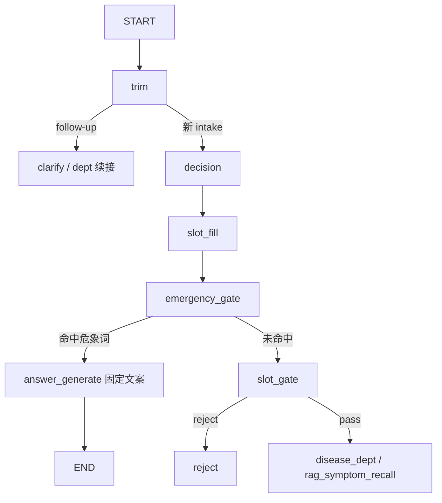

# 急诊 / 红旗症状硬规则门禁设计

**日期**: 2026-06-30  
**状态**: 已实现  
**范围**: 新 intake 首轮检测危象词，命中则状态机直转急诊固定回复，跳过 RAG / 澄清 / 消歧 / LLM 置信度

---

## 1. 背景与目标

### 1.1 现状

- 危象检测分散在 `slot_fill._EMERGENCY_RE`（仅增强 RAG 查询）、`dept_disambiguation._is_emergency()`（科室消歧阶段才判）、`dept_choices._is_emergency_term()`。
- 急诊路径锁定后仍经过 `dept_confidence` LLM 打分（≥60 才输出），与「硬规则、不让 LLM 自由发挥」冲突。
- `rag_knowledge.jsonl` 有 `EM0001`（`type: emergency`），但 `alliance` 仅含「大出血」，`default_department` 为「急症」；运行时未接入 intake 门禁。
- CL 链路 `red_flags` 在设计文档中规划为「后续迭代触发急诊覆盖」，尚未实现。

### 1.2 目标

在新 intake 的 `slot_fill` 之后增加 **emergency_gate** 硬规则节点：

- 复用 `rag_knowledge.jsonl` 中 `EM*` 条目的 `alliance` 作为危象词表（ enrich 至约 16 条）。
- 任意子串命中 → 锁 `急诊` + 固定模板回复，**不调用 LLM**。
- 未命中 → 走现有 `slot_gate → disease / rag / reject` 流程。
- follow-up（澄清 / 科室选项回复）**不重检**。

### 1.3 设计决策汇总

| 项 | 决策 |
|----|------|
| 检测时机 | **最早拦截**：`slot_fill` 后、`slot_gate` 前 |
| 检测范围 | **仅新 intake**（`decision → slot_fill` 路径）；follow-up 不重检 |
| 转急诊 vs reject | 危象词 → 转急诊；reject 沿用现有 `triage_route=reject` / `slot_gate`，与红旗无关 |
| 词表来源 | 复用 `rag_knowledge.jsonl` 的 `EM*` 条目；运行时 **直读 JSONL**，不走 OpenSearch |
| LLM 隔离 | 命中后跳过 RAG、澄清、消歧、`dept_confidence` |
| defense-in-depth | `dept_disambiguation._is_emergency` 改为调用同一 `match_emergency()`，避免双份词表 |

---

## 2. 架构

### 2.1 推荐方案

**方案 1：JSONL 直读 + 独立 `emergency_gate` 节点**（采用）

不采用：OpenSearch 检索 `type=emergency`（检索不确定、增加延迟）；在 `slot_fill` 内嵌检测（职责混杂）。

### 2.2 图编排



**关键：`emergency_gate` 在 `slot_gate` 之前**

用户仅输入「昏迷」等危象词、NER 未提取症状时，仍转急诊，而不是被 `slot_gate` reject。

### 2.3 新增 / 变更文件

| 文件 | 变更 |
|------|------|
| `app/triage/emergency_rules.py` | **新建**：加载 EM*、子串匹配 |
| `app/graph/nodes/emergency_gate.py` | **新建**：门禁节点 |
| `app/domain/routing.py` | 新增 `route_after_emergency_gate` |
| `app/graph/builder.py` | 插入节点与边 |
| `app/domain/models.py` | 可选字段 `emergency_match`、`emergency_gate_passed` |
| `app/graph/nodes/answer.py` | 急诊分支读 `emergency_reply` |
| `app/triage/slot_fill.py` | 删除 `_EMERGENCY_RE` 及 `table.emergency` 写入 |
| `app/graph/nodes/dept_disambiguation.py` | `_is_emergency` 改调 `match_emergency()` |
| `sourceData/data/rag_knowledge.jsonl` | enrich `EM0001` |
| `scripts/gen_triage_body_kb.py` | 同步 EM0001 模板 |
| `tests/test_emergency_gate.py` | **新建** |

---

## 3. 数据 Schema

### 3.1 EM0001 条目（enrich 后）

```json
{
  "id": "EM0001",
  "type": "emergency",
  "body_part": "全身",
  "gender": ["男", "女"],
  "age": ["0-3个月", "3个月-1岁", "2-4岁", "5-11岁", "12-18岁", "19-35岁", "35-59岁", "60岁及以上"],
  "alliance": [
    "大出血", "大量出血", "吐血", "咯血",
    "不能动", "动不了", "畸形", "不能负重",
    "发紫", "皮肤发黑", "意识不清", "昏迷",
    "剧烈", "受不了", "喘不过气", "胸痛憋气"
  ],
  "default_department": "急诊",
  "emergency_reply": "您描述的情况可能存在急危重症风险，请立即前往急诊或拨打 120。"
}
```

| 字段 | 说明 |
|------|------|
| `alliance` | 危象触发词，子串匹配 |
| `default_department` | 统一「急诊」（修正原「急症」） |
| `emergency_reply` | **新增可选字段**，固定回复后缀；缺省用全局默认文案 |

### 3.2 匹配规则

- 输入文本：`ner_result.query`（用户本轮原始输入）。
- 遍历所有 `type=emergency` 条目的 `alliance`；**任意子串命中即触发**。
- 多条同时命中：取 **最长匹配词**（减少短词误触）。
- 写入 state：`emergency_match = {keyword, em_id}`，供日志与评估。

### 3.3 加载

```python
# app/triage/emergency_rules.py
def load_emergency_entries(path: Path) -> list[dict]: ...
def match_emergency(text: str) -> EmergencyMatch | None: ...
```

- 模块 import 时加载 JSONL（与源数据路径 `sourceData/data/rag_knowledge.jsonl` 对齐）。
- 提供 `reload_emergency_entries()` 供测试注入 mock 词表。

---

## 4. 节点与路由

### 4.1 `emergency_gate_node`

```python
def emergency_gate_node(state: AppState) -> dict:
    text = (state.ner_result.query if state.ner_result else "") or ""
    hit = match_emergency(text)
    if hit is None:
        return {"emergency_gate_passed": True}
    return {
        "emergency_gate_passed": False,
        "locked_department": "急诊",
        "dept_state": DeptDisambiguationState(
            status="emergency",
            candidate_departments=[{"department": "急诊"}],
        ),
        "emergency_match": {"keyword": hit.keyword, "em_id": hit.em_id},
        "rag_chunk": hit.entry,
    }
```

### 4.2 `route_after_emergency_gate`

```python
def route_after_emergency_gate(state: AppState) -> str:
    if state.emergency_gate_passed is False and state.locked_department == "急诊":
        return "answer_generate"
    return "slot_gate"
```

`builder.py` 边：

```text
slot_fill → emergency_gate
emergency_gate --命中--> answer_generate → END
emergency_gate --未命中--> slot_gate → (现有分支)
```

### 4.3 `answer_generate` 急诊分支

固定模板，**不调 LLM**：

```text
建议尽快就诊：**急诊**。
{emergency_reply}
```

- 不含「已按您本轮新描述重新评估」前缀，不重复症状名。

- `emergency_reply` 取自命中 EM 条目的 `emergency_reply`，缺省：「您描述的情况可能存在急危重症风险，请立即前往急诊或拨打 120。」
- 不展示 `dept_confidence` 分数。
- `fetch_oncall` 仍跳过急诊（现有逻辑不变）。
- `triage_recorder` outcome 仍为 `emergency`。

---

## 5. 边界场景

| 场景 | 期望 |
|------|------|
| `脚脖子肿，不能动，皮发紫` | 首轮 → 急诊，无澄清 / 消歧 / LLM |
| `昏迷`（无症状实体） | 急诊（gate 在 slot_gate 前） |
| `我有胃炎` | 常规 disease 链 |
| `我有高血压，胸口剧烈疼` | 命中「剧烈」→ 急诊（危象优先于 disease） |
| 澄清 follow-up「不能动了」 | **不触发**（仅新 intake） |
| `你好` | 现有 reject，与红旗无关 |

---

## 6. 与现有代码的整合

| 位置 | 处理 |
|------|------|
| `slot_fill._EMERGENCY_RE` | **删除**；危象检测统一由 emergency_gate |
| `rag_symptom_recall` 中 `table.emergency` 拼接 | **删除**（无 emergency slot） |
| `dept_disambiguation._is_emergency` | 改调 `match_emergency(user_text)` |
| `dept_scoring` 中 `slot_emergency` | 保留参数但 slot 不再写入 emergency；或后续清理 |
| `turn_text` 中 `table.emergency` | 删除相关拼接 |

---

## 7. 测试

### 7.1 单元测试 `tests/test_emergency_gate.py`

- `match_emergency("不能动")` 命中
- `match_emergency("我有胃炎")` 未命中
- 最长匹配：`大量出血` 优先于 `出血`（若同时存在）
- `emergency_gate_node` 命中 → `locked_department=急诊`、`emergency_gate_passed=False`
- `route_after_emergency_gate` → `answer_generate`
- `answer_generate` 急诊文案含 `emergency_reply`

### 7.2 集成

- 更新 `scripts/integration_triage_db.py` emergency case
- 回归 `tests/test_fetch_oncall.py` 急诊跳过 MCP

### 7.3 验收命令

```bash
pytest tests/test_emergency_gate.py tests/test_fetch_oncall.py -q
python scripts/integration_triage_db.py  # emergency case in report
```

---

## 8. 非目标（本期不做）

- follow-up 轮次危象重检（用户明确选 B）
- OpenSearch 检索 `type=emergency` 作为触发源
- CL 链路 `red_flags` 阶段实现
- 新增 ambiguous 危象 → reject 分支
- 急诊路径展示 MCP 值班医生卡片

---

## 9. 后续迭代（记录）

- CL `red_flags` 选项命中后转急诊（需改为每轮检测或 red_flags 专用 gate）
- 按 body_part 拆分多个 EM 条目（EM0002 胸痛专类、EM0003 创伤专类等）
- 评估集标注 `actual_emergency` 与 `matched_keyword` 对齐
